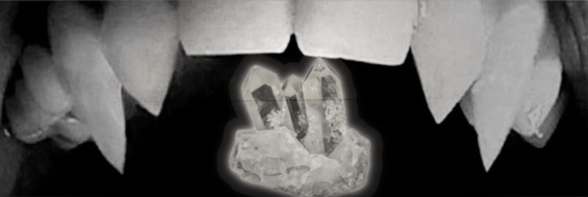

  

    

  

  # Crystal Chatbox
  **A modern VRChat OSC chatbox companion designed for convenience, expression, and modular features.**
  
   

  [⬇️ **Download Crystal Chatbox (Windows)**](https://github.com/Sapph1r3VRC/Crystal-Chatbox/releases/tag/v1.0.0)

   

  

---

## ✨ Features
- 📝 VRChat Chatbox Text Output
- ❤️ Heart Rate OSC (Pulsoid Integration)
- 👁️ Active Window Tracking
- 🔊 Sound/Audio Feedback
- 🎵 Song + Player Status Support
- 🤖 AI Message Modules (optional)
- 🧩 Modular Config System (Customization Friendly)

---

## 💻 Platform Support

| Platform | Status | Notes |
|---------|--------|-------|
| **Windows (.exe)** | ✅ **Available Now** | Download from Releases |
| **macOS (.app / .dmg)** | ⏳ Coming Soon | Universal Apple Silicon + Intel planned |
| **Linux (.AppImage / .deb)** | ⏳ Coming Soon | Targeting Ubuntu + Arch compatibility |
| **Android (.apk)** | ⏳ Coming Soon | Companion control app planned |

---

## 📥 Installation
1. Download the latest `.exe` from the **Releases** page.
2. Run the application — no installer needed.
3. In VRChat → **Settings → OSC**, ensure OSC is **Enabled**.
4. Configure features in the application UI.

---

## 📚 Documentation (Coming Soon)
- Config Guide
- Module Setup
- Troubleshooting
- OSC Behavior Reference

---

## ❓ FAQ

**Q: My heart rate isn't showing.**  
→ Ensure Pulsoid tokens are entered correctly & API access is granted.

**Q: Crystal Chatbox doesn’t appear in VRChat.**  
→ Make sure OSC is enabled in VRChat settings and restart VRChat after enabling.

**Q: Does this get me banned from VRChat?**  
→ No. Crystal Chatbox sends standard, allowed OSC messages — nothing exploitative.

---

## 🆘 Support

Need help or want to submit feedback?

- Join the Discord: https://discord.gg/3Qypg9vnEP
- Open an Issue: https://github.com/Sapph1r3VRC/Crystal-Chatbox/issues

---

## 👤 Credits
Developed by Sapph1r3
Thanks to friends + testers for feature inspiration and feedback.

---

## ⚖️ Legal Notice
Crystal Chatbox is source-available and **free for personal use.**  
Commercial redistribution or resale is not allowed without permission.

See: `LICENSE.md`, `TERMS.md`, and `PRIVACY.md` (coming soon).

